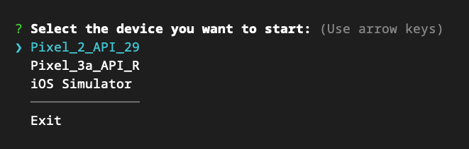

# emus

[](https://npm.im/emus) [](./LICENSE)

Start the Android Emulator and the iOS Simulator from the command line.
This cli gives you a list of virtual devices available on your machine, with the most recently opened (from the cli) at the top.



## Installation

```sh
yarn global add emus
```

or

```sh
npm install -g emus
```

## Usage

```
$ emus --help

  Start the Android Emulator and the iOS Simulator from the command line

  Usage
    $ emus [options]

  Options
    -a, --android             Start the Android Emulator
    -i, --ios                 Start the iOS Simulator

  Examples
    $ emus
    $ emus -a
    $ emus -i
```
